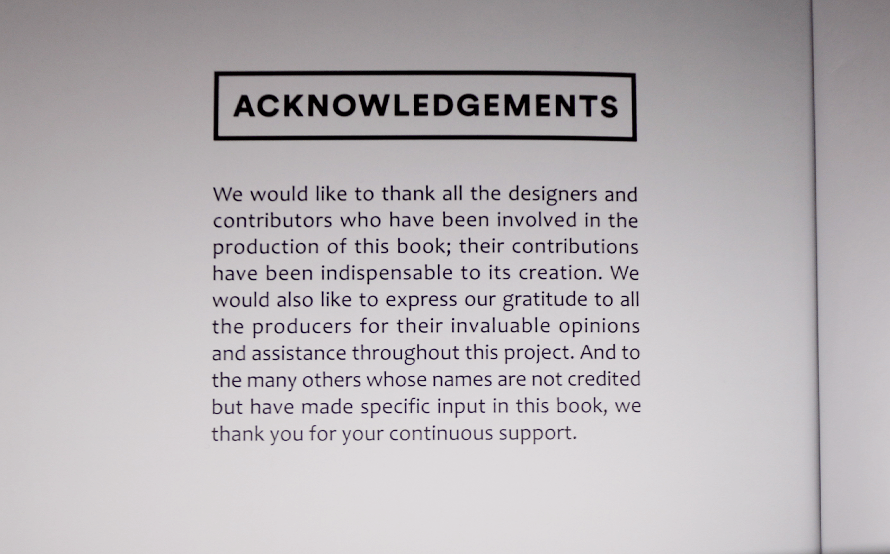

# Examples Showcase

## Purpose
Provides visual and JSON structural examples of how the benchmark represents data.

## Example Image



## Example Annotation
```json
{
    "id": "example-1",
    "language": "en",
    "text_regions": [
        {"bbox": [10, 10, 100, 50], "text": "Sample text"}
    ]
}
```

## Related Files
- `examples/example_input.png`
- `examples/example_output.png`
- `examples/example_annotation.json`
- `examples/sample_dataset.json`
