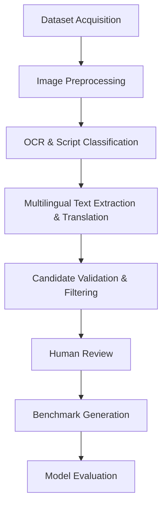

# Pipeline Documentation

## Purpose
Explains the real execution pipeline implemented in the `tools/` and `project/` directories. 

## Overall Benchmark Workflow

## Step-by-Step Implementation Status

### 1. Dataset Acquisition (Implemented)
- **Tools Used**: `tools/downloaders/` (`http_raw.py`, `huggingface.py`, `zenodo.py`), `tools/connectors/` (`cord_connector.py`, `funsd_connector.py`)
- **Process**: The system retrieves assets based on campaigns generated by `tools/planner/campaign_generator.py`.

### 2. Image Preprocessing (**Planned Feature**)
- **Status**: Planned
- **Process**: Will handle normalization and resizing prior to OCR.

### 3. OCR & Script Classification (**Planned Feature**)
- **Status**: Planned for local automation, currently handled via manual dataset connectors.
- **Process**: Bounding boxes and text region extraction are parsed from known schemas via connectors (e.g. `PaddleOCRConnector`).

### 4. Multilingual Text Extraction & Translation (**Planned Feature**)
- **Status**: Planned

### 5. Candidate Validation & Filtering (Implemented)
- **Tools Used**: `tools/verification/base_verifier.py`, `tools/ingestion/asset_validator.py`
- **Process**: Scripts like `validate_images.py` execute duplicate checks (`tools/duplicate_checker.py`), license checks (`tools/license_checker.py`), and structure checks.

### 6. Human Review (Implemented)
- **Tools Used**: `tools/review/reviewer.py`, `tools/review/mock_reviewer.py`
- **Process**: Reviewers orchestrate the staging manifest into the approved benchmark manifest using the `review_engine.py`.

### 7. Benchmark Generation (Implemented)
- **Tools Used**: `project/loader.py`, `tools/archive/`
- **Process**: Manifests are transformed into final evaluation structures, parsing schemas into the standard JSON.

### 8. Evaluation (Implemented)
- **Tools Used**: `evaluation/` module
- **Process**: Validates model outputs against the human-approved benchmark split using metrics defined in `evaluation/`.

## Related Files
- `tools/pipeline_orchestrator.py`
- `tools/verification/`
- `project/loader.py`
