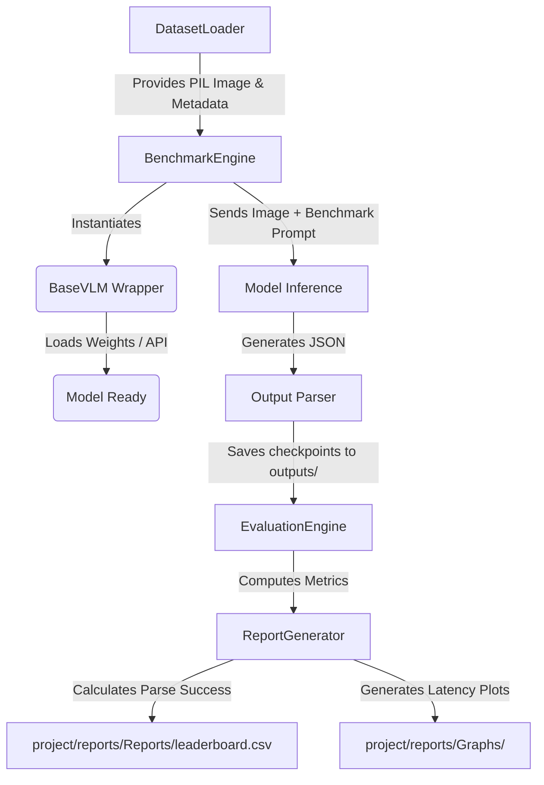

# Pipeline Architecture

The pipeline orchestrates image loading, prompt formulation, and strict JSON metric extraction to evaluate Vision Language Models strictly on the "Text in Image" task.

## Architecture Diagram

## Stage Descriptions

### 1. Image Loading
`DatasetLoader` parses JSONL manifests, actively downloading and locally caching missing files via HTTP.

### 2. Prompt Generation
The system loads the strict ruleset from `project/prompts/benchmark_prompt.txt`. This prompt enforces the extraction of text, detection of language/script, and forbids generic querying.

### 3. OCR & Script/Language Identification
The model analyzes the image to extract `ocr_text` preserving all formatting. It identifies all `scripts` and `languages` returning them as strict JSON string arrays.

### 4. Multilingual Processing (Translation & Transliteration)
The model targets the primary regional text, outputting:
- Original Text
- Romanized Pronunciation (Transliteration)
- English Translation

### 5. Text-Aware Question Generation
Instead of asking "What is written?", the model generates deep-reasoning QA pairs (e.g. "Which department issued this?").

### 6. Parsing, Evaluation, and Output
The `parse_and_clean_json` utility sanitizes the markdown strings from the LLM. The evaluator calculates OCR success rates, Parse validity, and QA completeness, generating final analytics in the `reports/` folder.

---
## Related Documentation
- [Installation](installation.md)
- [Configuration](configuration.md)
- [Datasets](datasets.md)
- [Models](models.md)
- [Pipeline](pipeline.md)
- [Examples](examples.md)
- [Troubleshooting](troubleshooting.md)
