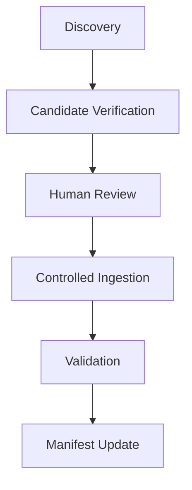

# Verification Pipeline Report
## Architecture Overview
The Candidate Verification Pipeline introduces a fast pre-flight check prior to human review and ingestion. It uses a modular `VerifierRegistry` to dispatch requests to specialized verifiers (e.g. `HttpVerifier`).

## Workflow Diagram

## Verification Policy
- Prefer `HEAD` requests for speed. Fall back to lightweight `GET`.
- Restrict MIME types to `image/*`.
- A candidate receives `READY` if and only if its status is `VERIFIED`.
- `PARTIALLY_VERIFIED` candidates are routed to `REVIEW_REQUIRED`.

## Performance Metrics
- **Average Response Time**: 116.0 ms
- **Average Content Length**: 374956 bytes

## Recommendations for Milestone 12
Deploy this hardened verification logic on the next scale-out discovery campaign to drastically reduce the 404/Connection Error rejection rates seen during ingestion.